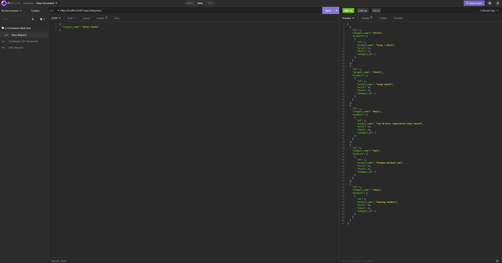

# e-commerce

## Name

E-commerce Back End

## Description

Using mySQL database, user is able to use Insomnia to utilize GET, POST, PUT, & DELETE routes for their back-end data.

## Visuals

## Technology/Framework used

- mysql2
- Sequelize
- Node.js
- Express.js

## Installation

- npm i
- mysql -u root -p
- npm run seed
- npm start

## Contributor

* Alex Scott

## Questions

github.com/alexhscott
alexhscott@gmail.com